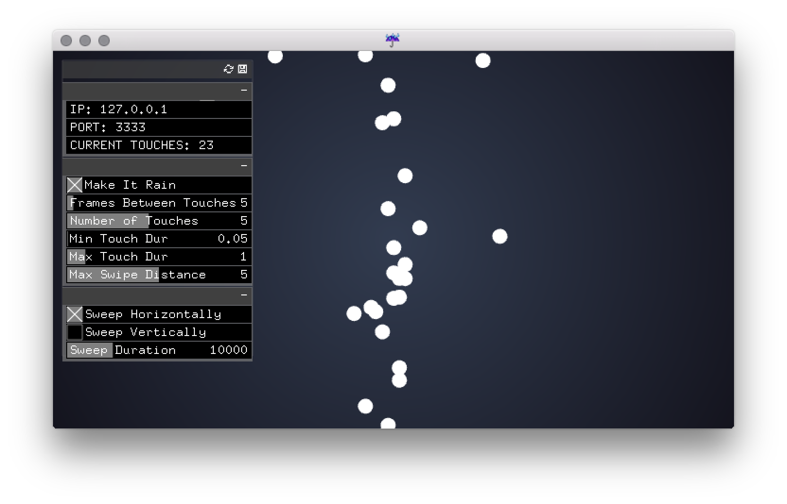

# tuioRain
Standalone app to send a storm of TUIO events for stability testing.

## About

##### Setup
- Set the IP and port of your TUIO listener in the `data/settings.xml` file.

##### Touches
- Emits `X` number of touch events every `Y` frames - set with GUI.
- Touches have a random time between the minimum and maximum touch duration.
- Touches have a 50% chance of being a 'swipe' which moves a random distance according to the max swipe distance slider.

##### Motion
- The overall motion can be purely random or swept horizontall or vertically with the total duration of that sweeping motion set with the slider below.

-

This was inspired by [Gal Sasson](https://github.com/galsasson)'s "Touch Rain" built into [ofxInterface](https://github.com/galsasson/ofxInterface). Check it out!
 
