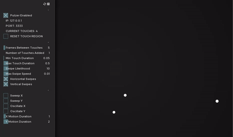

# 👇 Putzer!
Standalone app to send a storm of TUIO events for stability testing.

Inspired by [Gal Sasson](https://github.com/galsasson)'s "Touch Rain" built into [ofxInterface](https://github.com/galsasson/ofxInterface). Check it out!

## Dependencies
- openFrameworks 0.9~ and ofxTuioWrapper. Just `git submodule init` and `git submodule update`.

## Usage

### Setup
- Set the IP and port of your TUIO listener in the `data/settings.xml` file.

### Options

##### Touches
- Emits `X` number of touch events every `Y` frames - set with GUI.
- Touches have a random length between the minimum and maximum touch duration.
- Touches can be held and moved, creating swipes. Likelihood of a swipe is controlled in the GUI.
- Regular swipes will vary their drag speed over time creating "wiggles"
- Turning on `horizontal swipes` or `vertical swipes` will mix in purely horizontal and / or vertical swipes.

##### Motion
- The overall motion can be purely random or any combination of:
	- Swept horizontally or vertically across the screen and then starting back at the other side
	- Oscillated horizontally or vertically creating wave patterns across the screen
- Having just random motion or modifying it in just one direction allows you to create multiple random touches across the un-modified axis (`Number of Touches Added` in the gui.)
	- With both axis being modified only one touch is created per frame.

##### Regions
- You can create a region for touch to be restricted to by clicking and dragging within the window.
- The touch region can be reset by clicking `RESET TOUCH REGION` in the gui.
